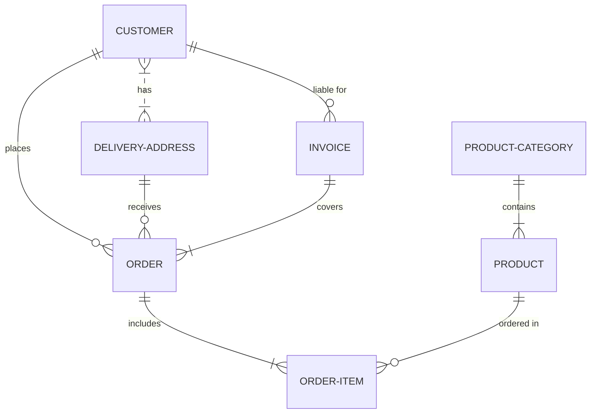

## Introduction

## Iteration #1

The first experiment that reached some level of stability is a small command line program that generates audio based on markov chains models. It has five available flags. `-debug` to enable debug logging - useful while developing, `-ngen` the number of successive generations to generate, `-files` the directory to save the audio files of each generation, `-models` the directory to save the generated markov chains models and `-seed` the seed markov chain models to kick start the process.

Running it produces folders containing the generated audio and the Markov chain models used for the generation in json format.

```
├── gen0
│   ├── 0.wav
│   ├── 1.wav
│   ├── amp.json
│   ├── dur.json
│   ├── freq.json
├── gen1
│   ├── 0.wav
│   ├── 1.wav
│   ├── amp.json
│   ├── dur.json
│   ├── freq.json
├── gen2
│   ├── 0.wav
│   ├── 1.wav
│   ├── amp.json
│   ├── dur.json
│   ├── freq.json
...
```

_Note that to run the program you need to either install `go` or download the binary named `markov1` from the module's github under [releases](https://github.com/bh90210/mlsic/releases)._

Under the hood the CLI uses the `markov` package to generate a "train" of sines waves. Iteration #1 uses additive synthesis to produce sound. The result is a monophonic synth. Each fundamental is treated for harmonics. Harmonics are read of a corresponding table and for iteration #1 are static and the same for each fundamental. Each generation uses the previous generation model to generate new values for the sine waves. Gen0 uses the seed models.



### Creating the seed

Blah blah.

<audio src="https://github.com/bh90210/mlsic/raw/trunk/docs/public/50.wav" controls preload></audio>