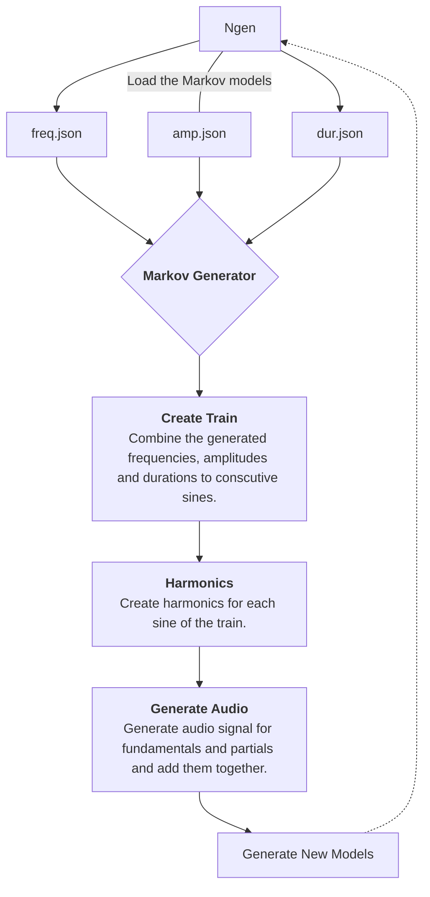

## Introduction

Lorem ipsum dolor sit amet, consectetur adipiscing elit. Cras eu purus congue, pretium tortor eu, semper dui. Cras faucibus pulvinar aliquet. Donec magna tortor, sodales in finibus faucibus, sodales vel justo. Duis condimentum orci eu dapibus pulvinar. Praesent sapien nunc, accumsan sit amet molestie nec, ultrices vitae lacus. Sed sit amet odio in sapien consequat consectetur cursus sit amet felis. Morbi eget rhoncus tellus. Praesent bibendum iaculis est, sed lobortis enim mollis a. Sed eu cursus leo. Quisque sit amet sem mauris. Sed gravida magna vel bibendum pharetra. Aliquam erat volutpat. Praesent mattis magna elementum magna sodales consequat. Praesent vel lorem lectus. Nulla sem dui, ultricies in dolor sed, tincidunt finibus est. Duis a sollicitudin metus, a pulvinar metus. 

## Iteration #1

The first experiment that reached some level of stability is a small command line program that generates audio based on markov chains models. It has five available flags. `-debug` to enable debug logging - useful while developing, `-ngen` the number of successive generations to generate, `-files` the directory to save the audio files of each generation, `-models` the directory to save the generated markov chains models and `-seed` the seed markov chain models to kick start the process.

Running it produces folders containing the generated audio and the Markov chain models used for the generation in json format.

```
├── gen0
│   ├── 0.wav
│   ├── 1.wav
│   ├── amp.json
│   ├── dur.json
│   ├── freq.json
├── gen1
│   ├── 0.wav
│   ├── 1.wav
│   ├── amp.json
│   ├── dur.json
│   ├── freq.json
├── gen2
│   ├── 0.wav
│   ├── 1.wav
│   ├── amp.json
│   ├── dur.json
│   ├── freq.json
...
```

_Note that to run the program you need to either install `go` or download the binary named `markov1` from the module's github under [releases](https://github.com/bh90210/mlsic/releases)._

Under the hood the CLI uses the `markov` package to generate a "train" of sines waves. Iteration #1 uses additive synthesis to produce audio signal. The result is a monophonic synth. Each fundamental is treated for harmonics. Harmonics are read of a corresponding table and for iteration #1 are static and the same for each fundamental. Each generation uses the previous generation's models to generate new values for the sine waves. Gen0 uses the seed models.



### Composition Strategy

The initial strategy is using Markov Chains  

### Creating the seed

Blah blah.

<audio src="https://github.com/bh90210/mlsic/raw/trunk/docs/public/50.wav" controls preload></audio>